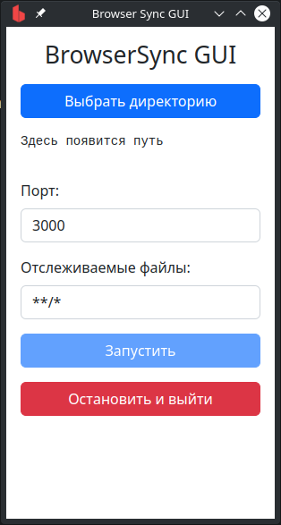

# Browser Sync GUI

GUI для Browser Sync.

## Сборка
```bash
yarn && yarn make
```

## Запуск
AppImage лежит в `dist`

# Если у вас Windows/MacOS
Собирайте сами =)
Ничего сложного, нужно лишь изменить команду сборки.
